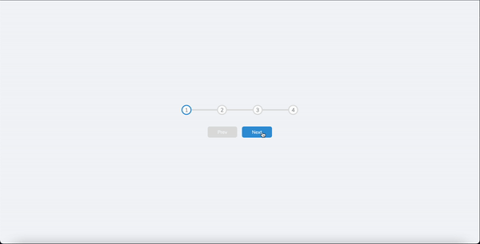

# Progress_Steps
This is a simple project that demonstrates progress steps with HTML, CSS, and JavaScript.

## Preview

## Features

- Displays progress steps with dynamic highlighting
- Responsive design that adapts to different screen sizes

## Technologies Used

- HTML
- CSS
- JavaScript

## Usage

1. Clone the repository: `git clone https://github.com/Lincoln2303/Progress_Steps.git`
2. Open the project in your web browser.
3. Interact with the progress steps to see the dynamic highlighting.

## License

This project is licensed under the [MIT License](LICENSE).

## Acknowledgements

- The project is part of the "50 projects in 50 days - HTML, CSS & Javascript" course on Udemy by Colt Steele.

## Contributing

Contributions are welcome! If you have any ideas or suggestions to improve the project, feel free to open an issue or submit a pull request.

